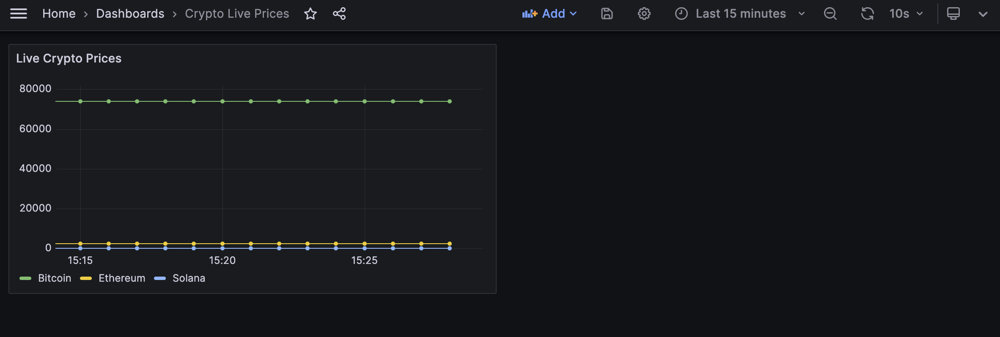

# Real-Time Crypto Market Pipeline

> Built real-time crypto data pipeline ingesting live prices every 30s via Kafka,
> storing to PostgreSQL with live Grafana monitoring dashboard.

## Live dashboard



## Architecture

```
CoinGecko API
     │  (every 5s)
     ▼
 producer.py  ──►  Kafka topic: crypto-prices  ──►  consumer.py  ──►  PostgreSQL
                                                                           │
                                                                           ▼
                                                                        Grafana
                                                                    (live dashboard)
```

## Stack
- **Python** — producer + consumer scripts
- **Apache Kafka** — real-time message streaming
- **PostgreSQL** — persistent storage
- **Grafana** — live visualization
- **Docker** — runs Kafka, Postgres, and Grafana locally

## How to run

### 1. Start all services
```bash
docker compose up -d
```

### 2. Run the producer (fetches prices + sends to Kafka)
```bash
python3 producer.py
```

### 3. In a new terminal, run the consumer (reads Kafka + saves to Postgres)
```bash
python3 consumer.py
```

### 4. Open Grafana
Go to http://localhost:3000 (login: admin / admin)
Add PostgreSQL as a data source, then build your dashboard.

## Stop everything
```bash
docker compose down
```
